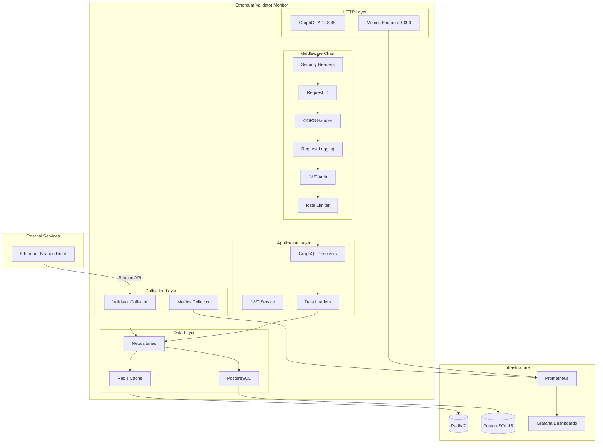

# Ethereum Validator Monitor

[](https://golang.org/dl/)
[](LICENSE)
[](https://goreportcard.com/report/github.com/birddigital/eth-validator-monitor)

A production-quality Go application for monitoring Ethereum validators with real-time performance tracking, comprehensive analytics, and intelligent alerting.

## Features

- 🔍 **Real-time Monitoring**: Track validator status, attestations, and proposals with sub-second granularity
- 📊 **Performance Analytics**: Score validators with effectiveness metrics and compare against network averages
- 🚨 **Smart Alerting**: Get notified of critical events, performance degradation, and slashing risks
- 📈 **Historical Data**: Track trends and analyze performance over time with PostgreSQL storage
- 🎯 **GraphQL API**: Flexible querying with real-time subscriptions for live updates
- 🐳 **Easy Deployment**: Docker Compose setup for quick starts with all infrastructure included
- 📉 **Observability**: Comprehensive Prometheus metrics and pre-configured Grafana dashboards
- 🔐 **Security**: JWT authentication, rate limiting, CORS protection, and request tracing
- 🚀 **High Performance**: Redis caching, connection pooling, and optimized database queries
- 🧪 **Well-Tested**: Unit tests, integration tests, and comprehensive benchmarking suite

## Table of Contents

- [Architecture](#architecture)
- [Quick Start](#quick-start)
- [API Documentation](#api-documentation)
- [Environment Variables](#environment-variables)
- [Deployment](#deployment)
- [Monitoring Setup](#monitoring-setup)
- [Troubleshooting](#troubleshooting)
- [Development](#development)
- [Contributing](#contributing)
- [License](#license)

## Architecture

### System Overview



### Component Details

| Component | Technology | Purpose | Port |
|-----------|-----------|---------|------|
| **GraphQL API** | gqlgen | Query/mutation interface for clients | 8080 |
| **Metrics Server** | Prometheus | Observability and monitoring | 9090 |
| **Database** | PostgreSQL 15 | Persistent storage for validators, snapshots, alerts | 5432 |
| **Cache** | Redis 7 | Performance optimization with TTL strategies | 6379 |
| **Time-series Monitoring** | Prometheus | Metrics collection and alerting | 9090 |
| **Dashboards** | Grafana | Visualization and alerting UI | 3000 |

### Data Flow

1. **Client Request** → HTTP Server (port 8080)
2. **Middleware Chain** → Security Headers → Request ID → CORS → Logging → Auth → Rate Limit
3. **GraphQL Layer** → Resolvers → Data Loaders (N+1 prevention)
4. **Repository Layer** → Check Redis Cache → Query PostgreSQL if cache miss
5. **Response** → Cache result in Redis → Return to client
6. **Background** → Validator Collector polls Beacon Node → Update database → Invalidate cache

## Quick Start

### Prerequisites

- **Go**: 1.21 or higher ([download](https://golang.org/dl/))
- **Docker**: 20.10+ with Docker Compose ([download](https://docs.docker.com/get-docker/))
- **PostgreSQL**: 15+ (included in Docker Compose)
- **Redis**: 7+ (included in Docker Compose)
- **Ethereum Beacon Node**: RPC access via Infura, Alchemy, or local node

### Installation (Docker Compose - Recommended)

```bash
# 1. Clone the repository
git clone https://github.com/birddigital/eth-validator-monitor.git
cd eth-validator-monitor

# 2. Copy environment template and configure
cp .env.example .env
# Edit .env with your settings (Beacon Node URL, database credentials, etc.)

# 3. Start all services (PostgreSQL, Redis, Prometheus, Grafana, API)
docker-compose up -d

# 4. View logs
docker-compose logs -f validator-monitor

# 5. Check health
curl http://localhost:8080/health
```

**Services will be available at:**
- GraphQL API: http://localhost:8080/graphql
- GraphQL Playground: http://localhost:8080
- Prometheus: http://localhost:9090
- Grafana: http://localhost:3000 (default credentials: `admin/admin`)
- Metrics: http://localhost:9090/metrics

### Installation (Manual Setup)

```bash
# 1. Clone the repository
git clone https://github.com/birddigital/eth-validator-monitor.git
cd eth-validator-monitor

# 2. Copy environment template
cp .env.example .env
# Edit .env with your configuration

# 3. Start infrastructure services only
docker-compose up -d postgres redis prometheus grafana

# 4. Install Go dependencies
go mod download

# 5. Run database migrations
make migrate-up

# 6. Build the application
make build

# 7. Run the server
make run
# Or directly: ./server
```

### Verifying Setup

```bash
# Check GraphQL API is running
curl http://localhost:8080/health

# Check Prometheus metrics are exposed
curl http://localhost:9090/metrics | grep validator_

# Access GraphQL Playground in browser
open http://localhost:8080

# Access Grafana dashboard
open http://localhost:3000
```

## API Documentation

### GraphQL API

The API is accessible at `http://localhost:8080/graphql` with an interactive playground at `http://localhost:8080`.

### Authentication

The API supports optional JWT authentication. If `JWT_SECRET_KEY` is set in environment variables, protected mutations require authentication.

**Register a user:**
```graphql
mutation Register {
  register(input: {
    email: "user@example.com"
    password: "SecurePassword123!"
  }) {
    accessToken
    refreshToken
    user {
      id
      email
    }
  }
}
```

**Login:**
```graphql
mutation Login {
  login(input: {
    email: "user@example.com"
    password: "SecurePassword123!"
  }) {
    accessToken
    refreshToken
    user {
      id
      email
    }
  }
}
```

**Use the access token in HTTP headers:**
```
Authorization: Bearer <accessToken>
```

### Core Queries

**Get a specific validator:**
```graphql
query GetValidator {
  validator(index: 123456) {
    index
    pubkey
    status
    balance {
      current
      effective
      withdrawable
    }
    performance {
      uptimePercentage
      attestationScore
      proposalSuccessRate
      effectiveness
      networkPercentile
      slashingRisk
    }
    alerts {
      severity
      type
      message
      createdAt
    }
  }
}
```

**List validators with filtering:**
```graphql
query ListValidators {
  validators(filter: {
    status: ACTIVE
    minEffectiveness: 95.0
  }) {
    index
    pubkey
    status
    performance {
      effectiveness
      uptimePercentage
    }
  }
}
```

**Get network statistics:**
```graphql
query NetworkStats {
  network {
    currentEpoch
    currentSlot
    totalValidators
    activeValidators
    participationRate
  }
}
```

**Query alerts:**
```graphql
query RecentAlerts {
  alerts(filter: {
    severity: CRITICAL
    startDate: "2025-10-17T00:00:00Z"
  }) {
    id
    validatorIndex
    severity
    type
    message
    acknowledged
    createdAt
  }
}
```

### Mutations

**Add a validator:**
```graphql
mutation AddValidator {
  addValidator(input: {
    pubkey: "0x1234567890abcdef..."
    name: "My Validator"
  }) {
    index
    pubkey
    name
    status
  }
}
```

**Acknowledge an alert:**
```graphql
mutation AcknowledgeAlert {
  acknowledgeAlert(id: "alert-id-here") {
    id
    acknowledged
    acknowledgedAt
  }
}
```

### Subscriptions (Real-time Updates)

**Monitor validator updates:**
```graphql
subscription MonitorValidators {
  validatorUpdates(indices: [123456, 789012]) {
    index
    status
    balance {
      current
    }
    performance {
      uptimePercentage
      effectiveness
    }
  }
}
```

**Monitor new alerts:**
```graphql
subscription NewAlerts {
  newAlerts(validatorIndices: [123456]) {
    id
    severity
    type
    message
    createdAt
  }
}
```

For complete API documentation, see [docs/API.md](docs/API.md).

### Code Examples

Example API clients are available in multiple languages:

- **JavaScript/TypeScript**: `examples/javascript/`
- **Python**: `examples/python/`
- **Go**: `examples/go/`
- **cURL**: `examples/curl/`

See [examples/README.md](examples/README.md) for setup and usage instructions.

## Environment Variables

All configuration is managed via environment variables. Copy `.env.example` to `.env` and customize:

### Server Configuration

| Variable | Default | Description |
|----------|---------|-------------|
| `HTTP_PORT` | `8080` | HTTP server port for GraphQL API |
| `GIN_MODE` | `release` | Gin framework mode (`debug`, `release`) |
| `PROMETHEUS_PORT` | `9090` | Metrics server port |

### Rate Limiting

| Variable | Default | Description |
|----------|---------|-------------|
| `RATE_LIMIT_ENABLED` | `true` | Enable/disable rate limiting |
| `RATE_LIMIT_RPS` | `10` | Requests per second per IP |
| `RATE_LIMIT_BURST` | `20` | Burst capacity for traffic spikes |

### CORS Configuration

| Variable | Default | Description |
|----------|---------|-------------|
| `CORS_ENABLED` | `true` | Enable/disable CORS |
| `CORS_ALLOWED_ORIGINS` | `http://localhost:3000` | Comma-separated list of allowed origins |
| `CORS_ALLOWED_METHODS` | `GET,POST,OPTIONS` | Allowed HTTP methods |
| `CORS_ALLOWED_HEADERS` | `Content-Type,Authorization` | Allowed request headers |
| `CORS_MAX_AGE` | `3600` | Preflight cache duration (seconds) |

### Database Configuration (PostgreSQL)

| Variable | Default | Description |
|----------|---------|-------------|
| `DB_HOST` | `localhost` | PostgreSQL host |
| `DB_PORT` | `5432` | PostgreSQL port |
| `DB_USER` | `postgres` | Database user |
| `DB_PASSWORD` | `postgres` | Database password |
| `DB_NAME` | `validator_monitor` | Database name |
| `DB_SSL_MODE` | `disable` | SSL mode (`disable`, `require`, `verify-ca`, `verify-full`) |
| `DB_MAX_CONNECTIONS` | `25` | Maximum connection pool size |
| `DB_MIN_CONNECTIONS` | `5` | Minimum connection pool size |
| `DB_MAX_CONN_LIFETIME` | `1h` | Maximum connection lifetime |
| `DB_MAX_CONN_IDLE_TIME` | `30m` | Maximum connection idle time |

### Redis Configuration

| Variable | Default | Description |
|----------|---------|-------------|
| `REDIS_ADDR` | `localhost:6379` | Redis server address |
| `REDIS_PASSWORD` | - | Redis password (if required) |
| `REDIS_DB` | `0` | Redis database number |
| `REDIS_POOL_SIZE` | `10` | Connection pool size |

### Beacon Chain Configuration

| Variable | Default | Description |
|----------|---------|-------------|
| `BEACON_NODE_URL` | - | **Required**: Beacon node HTTP endpoint (e.g., `https://beacon-nd-123-456-789.p2pify.com/...`) |
| `BEACON_NETWORK` | `mainnet` | Ethereum network (`mainnet`, `goerli`, `sepolia`) |

### JWT Authentication (Optional)

| Variable | Default | Description |
|----------|---------|-------------|
| `JWT_SECRET_KEY` | - | Secret key for signing tokens (if not set, auth is disabled) |
| `JWT_ISSUER` | `validator-monitor` | Token issuer identifier |
| `JWT_ACCESS_TOKEN_TTL` | `15m` | Access token lifetime |
| `JWT_REFRESH_TOKEN_TTL` | `168h` | Refresh token lifetime (7 days) |

### Logging Configuration

| Variable | Default | Description |
|----------|---------|-------------|
| `LOG_LEVEL` | `info` | Log level (`debug`, `info`, `warn`, `error`) |
| `LOG_FORMAT` | `json` | Log format (`json`, `console`) |
| `LOG_FILE_PATH` | - | Log file path (if not set, logs to stdout) |
| `LOG_MAX_SIZE` | `100` | Max log file size in MB (before rotation) |
| `LOG_MAX_BACKUPS` | `3` | Number of old log files to retain |
| `LOG_MAX_AGE` | `30` | Max days to retain old log files |

See [.env.example](.env.example) for the complete configuration template with detailed comments.

## Deployment

### Docker Production Deployment

The project includes production-ready Docker configurations with security hardening:

**Build and deploy:**
```bash
# Build production image
docker build -f docker/Dockerfile -t eth-validator-monitor:latest .

# Run with environment file
docker run -d \
  --name validator-monitor \
  --env-file .env \
  -p 8080:8080 \
  -p 9090:9090 \
  eth-validator-monitor:latest

# Or use Docker Compose for full stack
docker-compose -f docker-compose.yml up -d
```

**Production image features:**
- Multi-stage build for minimal image size
- Non-root user execution
- Security scanning with gosec
- Health checks configured
- Proper signal handling for graceful shutdown

### Kubernetes Deployment

Kubernetes manifests are available in the `k8s/` directory.

**Deploy to Kubernetes:**
```bash
# Create namespace
kubectl create namespace validator-monitor

# Deploy infrastructure (PostgreSQL, Redis)
kubectl apply -f k8s/postgres-statefulset.yaml
kubectl apply -f k8s/redis-deployment.yaml

# Deploy application
kubectl apply -f k8s/validator-monitor-deployment.yaml
kubectl apply -f k8s/validator-monitor-service.yaml

# Deploy monitoring (Prometheus, Grafana)
kubectl apply -f k8s/prometheus-deployment.yaml
kubectl apply -f k8s/grafana-deployment.yaml

# Check deployment status
kubectl -n validator-monitor get pods
```

**Access services:**
```bash
# Port-forward to access locally
kubectl -n validator-monitor port-forward service/validator-monitor 8080:8080
kubectl -n validator-monitor port-forward service/grafana 3000:3000

# Or use LoadBalancer/Ingress for production access
```

For complete Kubernetes deployment guide, see [k8s/README.md](k8s/README.md).

### Environment-Specific Configurations

**Development:**
- Use Docker Compose for local development
- Enable debug logging: `LOG_LEVEL=debug`
- Disable rate limiting for easier testing: `RATE_LIMIT_ENABLED=false`

**Staging:**
- Use Docker Compose or Kubernetes
- Enable JWT authentication
- Configure CORS for staging domains
- Use conservative cache TTLs

**Production:**
- Deploy with Kubernetes for high availability
- Enable all security features (JWT, rate limiting, CORS)
- Configure Alertmanager for notifications
- Use aggressive cache TTLs for performance
- Set up database backups
- Enable TLS/SSL for all connections

## Monitoring Setup

### Prometheus Metrics

Comprehensive metrics are exposed at `http://localhost:9090/metrics`.

**Validator Performance Metrics:**
- `validator_effectiveness_score` (Gauge) - Validator effectiveness (0-100)
- `validator_attestation_participation_rate` (Gauge) - Participation rate (0-1)
- `validator_proposal_success_rate` (Gauge) - Block proposal success rate
- `validator_balance_wei` (Gauge) - Current balance in Wei
- `validator_missed_attestations_total` (Counter) - Cumulative missed attestations
- `validator_snapshot_lag_seconds` (Gauge) - Data freshness lag

**API & System Metrics:**
- `api_request_duration_seconds` (Histogram) - Request latency with percentiles
- `api_requests_total` (Counter) - Total requests by endpoint and status
- `api_request_errors_total` (Counter) - Errors by type
- `db_query_duration_seconds` (Histogram) - Database query performance
- `db_connections_active` (Gauge) - Active database connections
- `goroutine_count` (Gauge) - Running goroutines
- `memory_alloc_bytes` (Gauge) - Memory allocation

**Cache Metrics:**
- `cache_hit_rate` (Gauge) - Cache hit percentage
- `cache_hits_total` (Counter) - Cache hits by key type
- `cache_misses_total` (Counter) - Cache misses by key type

### Grafana Dashboard

Access the dashboard at `http://localhost:3000` (default credentials: `admin/admin`).

**Dashboard Sections:**

1. **Validator Health Overview**
   - Overall effectiveness gauge with color-coded thresholds
   - Active validator count and status distribution
   - Network participation rate

2. **Validator Performance Details**
   - Per-validator performance table (filterable)
   - Block proposal success trends
   - Balance tracking over time
   - Attestation participation rates

3. **System Health & API Performance**
   - API latency percentiles (p50, p95, p99)
   - Request rate and error rate
   - Database query performance
   - Connection pool utilization
   - Memory and CPU usage
   - Goroutine health

4. **Alerts & Issues**
   - Recent missed attestations
   - Active alerts by severity
   - Rewards and penalties tracking

**Features:**
- Template variables for filtering by validator index
- Auto-refresh every 30 seconds
- Time range selection (default: 6 hours)
- Color-coded thresholds (green: healthy, yellow: warning, red: critical)

**Dashboard files:**
- `docker/grafana/dashboards/validator-monitoring.json` - Main dashboard
- `docker/grafana/provisioning/dashboards/default.yml` - Auto-provisioning config
- `docker/grafana/provisioning/datasources/prometheus.yml` - Data source config

### Alerting Rules

25+ alerting rules are configured in `docker/prometheus/alerts.yml`:

**Validator Health Alerts:**
- `ValidatorEffectivenessLow` - Effectiveness < 95% for 5 minutes
- `ValidatorEffectivenessCritical` - Effectiveness < 90% for 2 minutes
- `LowAttestationParticipation` - Participation < 98% for 10 minutes
- `MissedAttestations` - Any missed attestations in 5 minutes
- `ValidatorBalanceDecreasing` - Negative balance trend for 30 minutes

**API Health Alerts:**
- `BeaconAPIHighLatency` - p95 latency > 2s for 5 minutes
- `BeaconAPICriticalLatency` - p95 latency > 5s for 2 minutes
- `BeaconAPIHighErrorRate` - Error rate > 5% for 5 minutes
- `BeaconAPIDown` - API unreachable for 1 minute

**Data Freshness Alerts:**
- `ExtendedSnapshotLag` - Lag > 300s for 5 minutes
- `CriticalSnapshotLag` - Lag > 600s for 2 minutes
- `ValidatorSnapshotCollectionFailing` - No snapshots in 10 minutes

**System Resource Alerts:**
- `HighMemoryUsage` - Memory > 2GB for 10 minutes
- `CriticalMemoryUsage` - Memory > 4GB for 5 minutes
- `GoroutineLeakSuspected` - Goroutines > 1000 for 15 minutes

View alerts in Prometheus: `http://localhost:9090/alerts`

## Troubleshooting

### Common Issues

**1. GraphQL API not responding**

Check service is running:
```bash
docker-compose ps
curl http://localhost:8080/health
```

Check logs:
```bash
docker-compose logs validator-monitor
```

Verify configuration:
```bash
docker-compose exec validator-monitor env | grep -E '^(HTTP_PORT|DB_|REDIS_|BEACON_)'
```

**2. Database connection errors**

Check PostgreSQL is running:
```bash
docker-compose ps postgres
docker-compose exec postgres pg_isready
```

Test connection:
```bash
docker-compose exec postgres psql -U postgres -d validator_monitor -c '\dt'
```

Check credentials in `.env` match `docker-compose.yml`.

**3. Redis cache errors**

Check Redis is running:
```bash
docker-compose ps redis
docker-compose exec redis redis-cli ping
```

Test connection:
```bash
docker-compose exec redis redis-cli KEYS "*"
```

**4. High snapshot lag**

Check Beacon Node connectivity:
```bash
curl $BEACON_NODE_URL/eth/v1/node/health
```

Check collector logs:
```bash
docker-compose logs validator-monitor | grep -i "collector\|beacon"
```

Verify `BEACON_NODE_URL` is correct in `.env`.

**5. Missing metrics in Grafana**

Check Prometheus is scraping:
```bash
curl http://localhost:9090/api/v1/targets
```

Verify metrics endpoint is accessible:
```bash
curl http://localhost:9090/metrics | grep validator_
```

Check Grafana data source configuration:
```bash
open http://localhost:3000/datasources
```

### Using Request IDs for Tracing

Every API request gets a unique `X-Request-ID` header for tracing:

**Check request ID in response:**
```bash
curl -v http://localhost:8080/health 2>&1 | grep -i x-request-id
```

**Search logs by request ID:**
```bash
docker-compose logs validator-monitor | grep "request_id=abc123"
```

**Log format:**
```json
{
  "level": "info",
  "request_id": "abc123-def456-ghi789",
  "method": "POST",
  "path": "/graphql",
  "status": 200,
  "latency_ms": 42,
  "ip": "172.18.0.1",
  "user_agent": "GraphQL Playground"
}
```

### Performance Debugging

**Enable debug logging:**
```bash
# In .env
LOG_LEVEL=debug
LOG_FORMAT=console

# Restart service
docker-compose restart validator-monitor
```

**Check goroutine leaks:**
```bash
curl http://localhost:9090/metrics | grep goroutine_count
```

**Check memory usage:**
```bash
curl http://localhost:9090/metrics | grep memory_
```

**Check database connection pool:**
```bash
curl http://localhost:9090/metrics | grep db_connections_
```

**Run benchmarks:**
```bash
make benchmark
make benchmark-mem
```

### Getting Help

If you encounter issues not covered here:

1. Check the [GitHub Issues](https://github.com/birddigital/eth-validator-monitor/issues)
2. Review logs with `docker-compose logs -f`
3. Enable debug logging: `LOG_LEVEL=debug`
4. Open a new issue with:
   - Go version (`go version`)
   - Docker version (`docker --version`)
   - Error logs
   - Request ID (if applicable)
   - Steps to reproduce

## Development

### Development Setup

```bash
# Install development tools
make install-tools

# Run tests
make test

# Run tests with coverage
make test-coverage

# View coverage report in browser
make test-coverage && open coverage.html

# Run linters
make lint

# Format code
make fmt

# Generate GraphQL code
make generate
```

### Database Migrations

```bash
# Create a new migration
make migrate-create NAME=add_new_table

# Apply migrations
make migrate-up

# Rollback last migration
make migrate-down

# Check migration status
make migrate-status
```

### Performance Benchmarking

The project includes a comprehensive benchmarking suite:

```bash
# Run all benchmarks
make benchmark

# Quick benchmarks (1s duration)
make benchmark-quick

# Set baseline for comparisons
make benchmark-baseline

# Compare with baseline
make benchmark-compare

# Memory profiling
make benchmark-mem
make benchmark-view-mem

# CPU profiling
make benchmark-cpu
make benchmark-view-cpu
```

**Performance Targets:**

| Component | Target | Validator Count |
|-----------|--------|-----------------|
| Validator Collection | < 5s | 10,000 |
| Database Batch Insert | < 2s | 10,000 snapshots |
| GraphQL Query (p95) | < 100ms | 100 results |
| Redis Cache Get | < 1ms | Single operation |
| Beacon API Call (p95) | < 500ms | With retry logic |

### Code Quality

```bash
# Run static analysis
make lint

# Security scan
make security-scan

# Check for race conditions
go test -race ./...

# Generate mocks
make mocks
```

### Task Master AI Integration

This project uses [Task Master AI](https://github.com/kkhaulinsoft/taskmaster-ai) for intelligent task management.

**Common commands:**
```bash
# View next task
task-master next

# View all tasks
task-master list

# Show task details
task-master show <id>

# Mark task complete
task-master set-status --id=<id> --status=done

# Add new task
task-master add-task --prompt="Feature description" --research

# Expand task into subtasks
task-master expand --id=<id> --research
```

See [CLAUDE.md](CLAUDE.md) for complete Task Master integration guide.

## Contributing

Contributions are welcome! Please follow these guidelines:

### Workflow

1. **Fork the repository**
2. **Create a feature branch**: `git checkout -b feature/my-feature`
3. **Make your changes** and add tests
4. **Run tests**: `make test`
5. **Run linters**: `make lint`
6. **Format code**: `make fmt`
7. **Commit changes**: `git commit -m "feat: add my feature"`
8. **Push to branch**: `git push origin feature/my-feature`
9. **Open a Pull Request**

### Commit Message Format

Follow [Conventional Commits](https://www.conventionalcommits.org/):

```
feat: add validator effectiveness scoring
fix: resolve database connection leak
docs: update API documentation
test: add unit tests for cache layer
refactor: optimize database queries
perf: improve GraphQL resolver performance
chore: update dependencies
```

### Code Style

- Follow Go best practices and [Effective Go](https://golang.org/doc/effective_go)
- Use `gofmt` and `goimports` for formatting
- Add comments for exported functions and types
- Write table-driven tests
- Keep functions small and focused
- Use meaningful variable names

### Testing Requirements

- Unit tests for all new features
- Integration tests for API endpoints
- Benchmarks for performance-critical code
- Minimum 80% code coverage
- All tests must pass before merging

### Pull Request Checklist

- [ ] Tests added and passing
- [ ] Linters passing
- [ ] Documentation updated
- [ ] Commit messages follow convention
- [ ] No breaking changes (or clearly documented)
- [ ] Performance benchmarks included (if applicable)

## License

MIT License - see [LICENSE](LICENSE) for details.

## Author

Built by [Adrien Bird](https://github.com/birddigital).

This project demonstrates:
- Production-quality Go application architecture
- Ethereum/blockchain infrastructure understanding
- GraphQL API design and implementation
- Observability and monitoring best practices
- Container orchestration and deployment
- Comprehensive testing and benchmarking

## Project Status

✅ **Production Ready** - Core functionality complete with comprehensive testing, monitoring, and documentation.

**Current Features:**
- ✅ Real-time validator monitoring
- ✅ GraphQL API with authentication
- ✅ PostgreSQL storage with migrations
- ✅ Redis caching with TTL strategies
- ✅ Prometheus metrics and Grafana dashboards
- ✅ Security hardening (JWT, CORS, rate limiting)
- ✅ Docker and Kubernetes deployment configs
- ✅ Comprehensive testing and benchmarking
- ✅ Production-ready documentation

**Planned Enhancements:**
- Beacon Chain event subscriptions for real-time updates
- Advanced alerting with Alertmanager integration
- Multi-validator portfolio analytics
- Historical performance comparison tools
- Mobile-responsive web dashboard

---

**Built with ❤️ for the Ethereum community**
